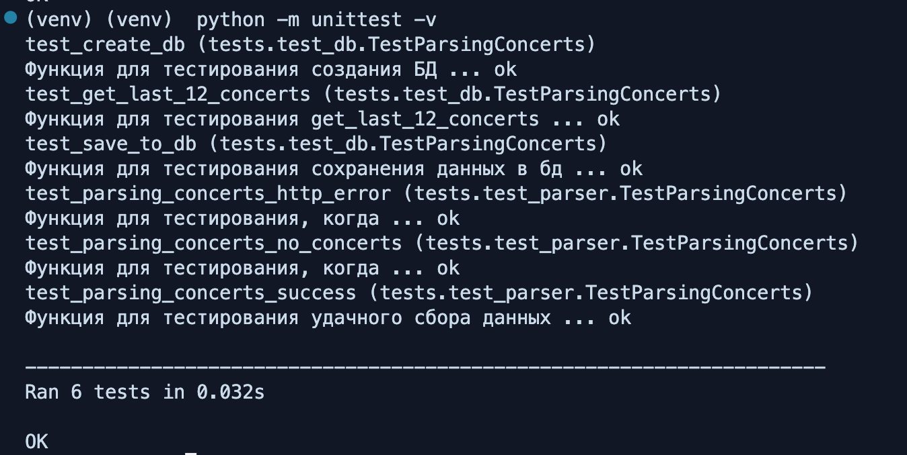

# Телеграм-Бот для Парсинга Яндекc Афиши

## Описание

Этот проект представляет собой телеграм-бота, который парсит данные с сайта Яндекс Афиша, сохраняет их в базу данных и предоставляет пользователям возможность запросить эти данные через команды бота.

## Функции

1. **Сбор данных с веб-страницы:**
   - Парсинг данных с указанного веб-сайта.
   - Сохранение данных в базу данных.

2. **Работа с базой данных:**
   - Хранение и извлечение данных.
   - Запрос данных пользователем через бота.

3. **Создание телеграм-бота:**
   - Взаимодействие с пользователем через бота.
   - Реализация команд:
     - `/start` - Запуск бота.
     - `/latest` - Получение последних данных с веб-сайта.
     - `/search <ключевое_слово>` - Поиск данных по ключевому слову.

## Требования

1. **Парсинг:**
   - Использование библиотеки BeautifulSoup или Scrapy.
   - Код должен быть чистым и с комментариями.

2. **База данных:**
   - Использование SQLite или PostgreSQL.
   - Реализация операций CRUD (Create, Read, Update, Delete).
   - База данных находится в `db/concerts.db`.

3. **Телеграм-бот:**
   - Использование библиотеки python-telegram-bot или aiogram.
   - Обработка команд `/start`, `/latest`, `/search <название исполнителя>`.

4. **Дополнительно:**
   - Код должен быть загружен в репозиторий на GitHub с подробным README файлом.

## Установка и Запуск

1. **Клонирование репозитория:**
   ```bash
   git clone https://github.com/Danila-19/parser_telegram_bot

## Запуск проекта

1. **Настройка виртуального окружения:**
    ```bash
    python -m venv venv
    source venv/bin/activate #Для Unix
    source venv/Scripts/activate # Для Windows

2. **Установка зависимостей:**
    ```bash
    pip install -r requirements.txt

3. **Настройка переменных окружения:**
    -Создайте файл .env в корне проекта и добавьте следующие переменные:
        -TELEGRAM_TOKEN=your_telegram_bot_token

4. **Запуск парсинга и создание базы данных:**
    ```bash
    python main.py

5. **Запуск бота:**
    ```bash
    python bot.py


# CRUD Операции

## Создание нового концерта:
    ```bash
    python crud_operations.py create --title 'Баста' --date '13 сентября' --location 'VK Gipsy'

## Чтение всех концертов:
    ```bash
    python crud_operations.py read

## Обновление концерта:
    ```bash
    python crud_operations.py update --id 21 --title 'Обновленный концерт' --date '10 августа' --location 'Лужники'

## Удаление концерта:
    ```bash
    python crud_operations.py delete --id <id концерта>


# Тестирование
Тестирование включает проверку функциональности парсинга, работы с базой данных.
    ```bash
    python -m unittest --v

# Результаты



- бот протестирован в ручную

# Результаты работы

1. **Создал проект и настроил виртуальное окружение.**

2. **Реализовал парсинг данных с веб-страницы и сохранение их в базу данных.**

3. **Настроил и подключить базу данных**

4. **Реализовал телеграм-бота и подключил команды.**

5. **Провел тестирование и отладку всех компонентов.**

6. **Оформил документацию и загрузку проекта на GitHub.**
